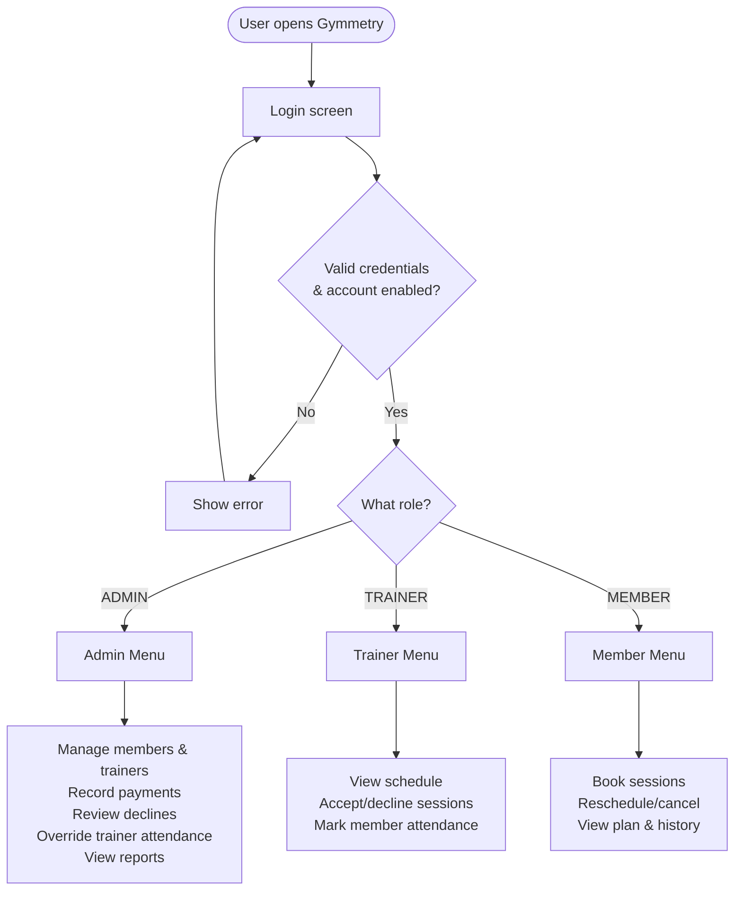
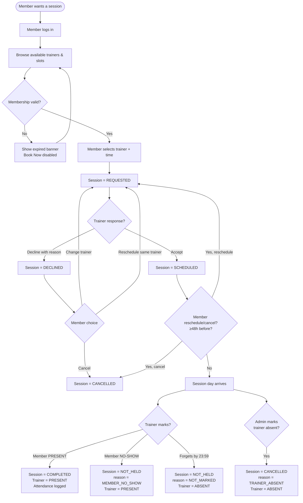
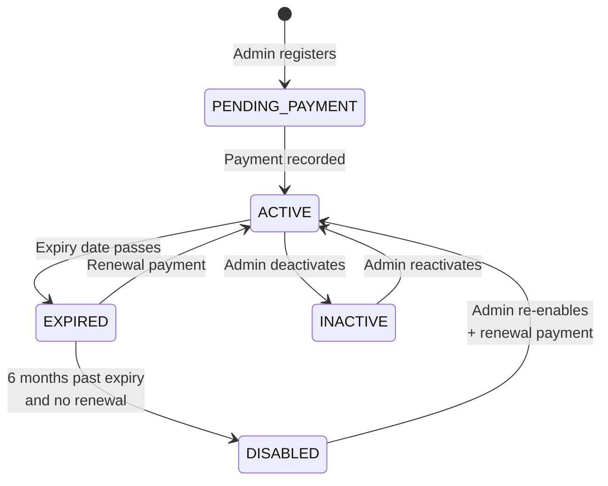
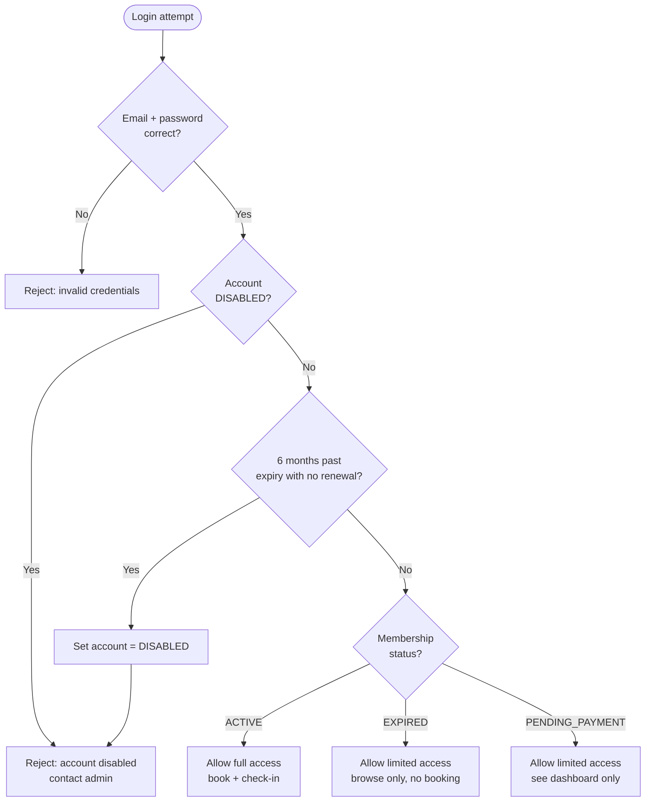

# Gymmetry — Gym Membership System

> A gym membership management system built with Java (backend) and
> React + TypeScript (frontend). This document is the single source of
> truth for the system's behavior, workflows, and domain model.

---

## 1. Overview

Gymmetry manages gym memberships, session bookings, trainer
scheduling, attendance tracking, and payments. It supports three
logged-in roles: Admin, Trainer, and Member.

**Primary sequence:**
Member registration → Payment → Access granted → Session booking →
Attendance logging

---

## 2. Actors

| Actor | Description |
|-------|-------------|
| **Admin** | Manages gym operations, reviews declines, overrides trainer attendance, records payments, views reports |
| **Trainer** | Accepts/declines session requests, records member attendance |
| **Member** | Books sessions, reschedules/cancels with notice, views own data |

---

## 3. Authentication

- All three roles log in with **email + password**.
- Admin account is **seeded by the developer** at first startup.
- Admin creates **Trainer** and **Member** accounts.
- First login for Trainer and Member requires a **password change**.
- Passwords are hashed (BCrypt).

---

## 4. Domain Model

### 4.1 Person Hierarchy
```
Person (abstract)
├── Member
├── Trainer
└── Admin
```

### 4.2 Membership Plans
```
MembershipPlan (abstract)
├── BasicPlan
├── PremiumPlan
└── VipPlan
```

Each plan defines:
- Name
- Monthly fee
- Duration in months
- Feature list

### 4.3 Other Domain Classes
- `Session` — a booked appointment between a Member and a Trainer
- `Payment` — a payment record for a membership period
- `AttendanceRecord` — proof of member attendance at a session
- `User` — login credentials + role + account status

### 4.4 Services
- `Gym` — business logic (members, trainers, sessions, payments)
- `AuthService` — login, logout, password change

---

## 5. Enums

```java
enum Role {
    ADMIN, TRAINER, MEMBER
}

enum MembershipStatus {
    PENDING_PAYMENT, ACTIVE, EXPIRED, INACTIVE
}

enum AccountStatus {
    ENABLED, DISABLED
}

enum SessionStatus {
    REQUESTED,   // awaiting trainer response
    SCHEDULED,   // trainer accepted
    DECLINED,    // trainer declined — member must decide
    CANCELLED,   // cancelled (member, admin, or trainer-absent)
    COMPLETED,   // member attended
    NOT_HELD     // session didn't happen
}

enum TrainerSessionStatus {
    PENDING, PRESENT, ABSENT
}

enum NotHeldReason {
    MEMBER_NO_SHOW,   // trainer marked member absent
    NOT_MARKED        // deadline passed, trainer never marked
}

enum CancellationReason {
    MEMBER_CANCELLED_IN_TIME,
    ADMIN_CANCELLED,
    TRAINER_ABSENT
}

enum PaymentMethod {
    CASH, CARD, GCASH
}

enum PaymentStatus {
    PENDING, PAID, REFUNDED
}
```

---

## 6. Membership Lifecycle

### 6.1 Statuses
- **PENDING_PAYMENT** — registered, awaiting first payment
- **ACTIVE** — paid, within validity period
- **EXPIRED** — past expiry date
- **INACTIVE** — manually deactivated by Admin

### 6.2 Registration Flow
1. Admin enters member details + selects a plan
2. System creates Member with status = `PENDING_PAYMENT`
3. Admin records the first Payment
4. On success:
   - `startDate = today`
   - `expiryDate = today + plan.durationMonths`
   - `membershipStatus = ACTIVE`

### 6.3 Renewal Flow
- **Before expiry**: new period stacks on top of existing `expiryDate`
- **After expiry**: new period starts from today
- Either way: Admin records a Payment, Member stays/goes `ACTIVE`

### 6.4 6-Month Auto-Disable
- If a member does not renew within **6 months** of `expiryDate`,
  their `AccountStatus` becomes `DISABLED`.
- Enforced **lazily on login attempt** (instant effect).
- Admin can re-enable at any time (typically with a renewal).

---

## 7. Session Lifecycle

### 7.1 State Transitions

| From       | Event                                        | To          |
|------------|----------------------------------------------|-------------|
| —          | Member books (or Admin books)                | REQUESTED   |
| REQUESTED  | Trainer accepts                              | SCHEDULED   |
| REQUESTED  | Trainer declines (with reason)               | DECLINED    |
| DECLINED   | Member chooses to change trainer             | REQUESTED   |
| DECLINED   | Member chooses to reschedule same trainer    | REQUESTED   |
| DECLINED   | Member cancels                               | CANCELLED   |
| SCHEDULED  | Member reschedules (≥48h before)             | REQUESTED   |
| SCHEDULED  | Member cancels (≥48h before)                 | CANCELLED   |
| SCHEDULED  | Trainer marks member PRESENT                 | COMPLETED   |
| SCHEDULED  | Trainer marks member NO-SHOW                 | NOT_HELD    |
| SCHEDULED  | Deadline passes, Trainer never marked        | NOT_HELD    |
| SCHEDULED  | Admin marks Trainer absent                   | CANCELLED   |

**Deadline**: 23:59 of the session's date.

### 7.2 Session Outcomes

| Trigger                                       | Trainer status | Session status | Reason |
|-----------------------------------------------|----------------|----------------|--------|
| Trainer marks member PRESENT                  | PRESENT        | COMPLETED      | — |
| Trainer marks member NO-SHOW                  | PRESENT        | NOT_HELD       | MEMBER_NO_SHOW |
| Deadline passes, Trainer never marked         | ABSENT         | NOT_HELD       | NOT_MARKED |
| Admin marks Trainer absent                    | ABSENT         | CANCELLED      | TRAINER_ABSENT |
| Trainer DECLINES a REQUESTED session          | not affected   | DECLINED       | — |
| Member cancels (≥48h before)                  | not tracked    | CANCELLED      | MEMBER_CANCELLED_IN_TIME |
| Admin cancels directly                        | not tracked    | CANCELLED      | ADMIN_CANCELLED |

### 7.3 Rules
- Trainer attendance applies **only to SCHEDULED sessions**.
- Declining a REQUESTED session does **NOT** mark the Trainer absent.
- Trainer attendance is **visible to Admin only**.
- Admin override of Trainer attendance is **always allowed**.
- Cancelled/declined sessions do **not** track attendance.

---

## 8. Member Session Editing

- Member may reschedule or cancel a session only if:
  - Status is `REQUESTED` or `SCHEDULED`, AND
  - At least **48 hours** remain before the session
- **Reschedule** → session returns to `REQUESTED`
- **Cancel** → session becomes `CANCELLED` (reason: `MEMBER_CANCELLED_IN_TIME`)

### After a Decline
When a Trainer declines, the Member is prompted to:
1. **Change trainer** → session returns to `REQUESTED` with new trainer
2. **Reschedule with the same trainer** → session returns to `REQUESTED` with new time
3. **Cancel the session** → `CANCELLED`

---

## 9. Attendance

Two distinct concepts:

### 9.1 Member Attendance
- Created only when a Trainer marks a session **COMPLETED**.
- `NO_SHOW` / `CANCELLED` / `NOT_HELD` sessions do **not** produce member attendance.
- Tied to a specific session.

### 9.2 Trainer Attendance (per session)
- Derived from session outcome (see §7.2).
- Admin can **override** any session's trainer status at any time,
  with an optional reason.
- Visible to Admin only.

---

## 10. Gating Rules

| Action                              | Expired member | Disabled account |
|-------------------------------------|----------------|------------------|
| Log in                              | ✅             | ❌               |
| View own profile                    | ✅             | ❌               |
| View past sessions / attendance     | ✅             | ❌               |
| Browse available trainers and slots | ✅             | ❌               |
| Confirm a booking                   | ❌             | ❌               |
| Check in at gym                     | ❌             | ❌               |

**Rationale:**
- Expired members can still browse to plan ahead. Book Now is
  disabled, but the UI shows their expired status prominently.
- Only after 6 months of no renewal does the account become
  `DISABLED` and login is blocked.

**Enforcement:**
- Service-layer methods throw `MembershipExpiredException` and
  `AccountDisabledException`.
- UI reflects this, but never trusts itself.

---

## 11. Use Cases by Role

### 11.1 Admin
- Register member (creates Member + User)
- Onboard trainer (creates Trainer + User)
- Record payment
- Renew / change plan
- Book session on behalf of member
- Approve declines or reassign declined sessions
- Override Trainer session attendance
- Log Trainer attendance / view trainer presence
- View reports (revenue, attendance, session outcomes, trainer
  presence, members per plan)
- Enable / disable Member accounts

### 11.2 Trainer
- Log in (first login requires password change)
- View own session schedule
- Accept session requests
- Decline session requests (with **required** reason)
- Mark session as COMPLETED (member present)
- Mark session as NOT_HELD (member no-show)
- View own profile
- View own attendance history

### 11.3 Member
- Log in (first login requires password change)
- Book session (pick trainer + time)
- Reschedule or cancel session (≥48h notice)
- Respond to declined session (change trainer / reschedule / cancel)
- View own plan, upcoming sessions, attendance history
- Update own profile

---

## 12. Payments

Each `Payment` record stores:
- Member
- Plan paid for
- Amount
- Method (`CASH` / `CARD` / `GCASH`)
- Status (`PENDING` / `PAID` / `REFUNDED`)
- Date/time
- Admin who recorded it
- Optional notes

**v1:** No online payment gateway. Admin records payments manually.

---

## 13. Reports (Admin)

- Total monthly revenue
- Active vs. inactive members
- Attendance count per member
- Sessions completed vs. not held per member
- Sessions per trainer
- Declines per trainer
- Trainer presence history
- Members per plan

---

## 14. Workflow Diagrams

### 14.1 Master Flow


### 14.2 Session Lifecycle


### 14.3 Member Account Lifecycle


### 14.4 Login & Gating


---

## 15. Out of Scope (v1)

- Online payment gateway
- Walk-in attendance (no session)
- Email / SMS notifications
- Web UI (v1 = console app)
- Password reset via email
- Multi-branch support

---

## 16. Future (Phase 2+)

- Spring Boot REST API
- React + TypeScript frontend
- PostgreSQL persistence
- JWT-based sessions
- Payment gateway integration
- Trainer specialty filtering
- Reports dashboards
- Email / SMS notifications
- Walk-in attendance

---

## 17. Tech Stack

| Layer | Technology |
|-------|------------|
| Backend | Java 17, Maven |
| (Future) | Spring Boot, PostgreSQL |
| Frontend | React + TypeScript (Vite) |
| Version control | Git + GitHub |

---

## 18. Project Structure

```
gymmetry/
├── REQUIREMENTS.md          ← this file
├── README.md
├── .gitignore
├── backend/                 ← Java (Maven)
│   ├── pom.xml
│   └── src/
│       ├── main/java/dev/gymmetry/
│       │   ├── GymmetryApplication.java
│       │   ├── domain/
│       │   ├── service/
│       │   ├── repository/
│       │   ├── exception/
│       │   └── enums/
│       └── test/java/dev/gymmetry/
└── frontend/                ← React + TypeScript (Vite)
    ├── package.json
    └── src/
```

---

## 19. Build Order (Development Phases)

1. **Domain classes** — Person, Member, Trainer, Admin,
   MembershipPlan + subclasses, enums
2. **Session, Payment, AttendanceRecord** — with state transitions
3. **Exceptions** — MemberNotFound, MembershipExpired, etc.
4. **Services** — Gym, AuthService
5. **Console UI** — login, role-based menus, loops
6. **JUnit tests** — verify workflows and state transitions
7. **Persistence** — file storage, then PostgreSQL
8. **REST API** — Spring Boot wrapper around services
9. **Frontend** — React + TypeScript

---

*Last updated: (date)*